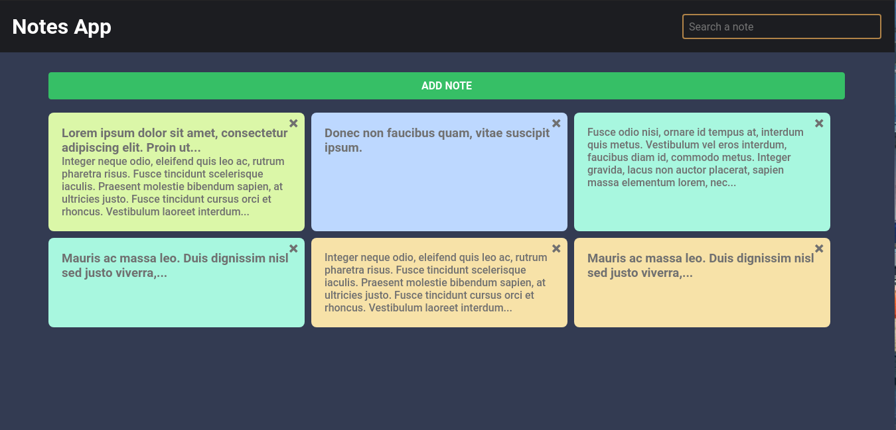
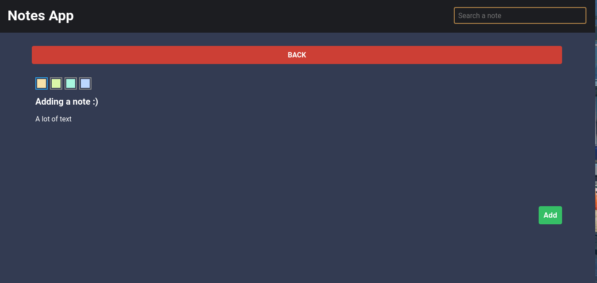
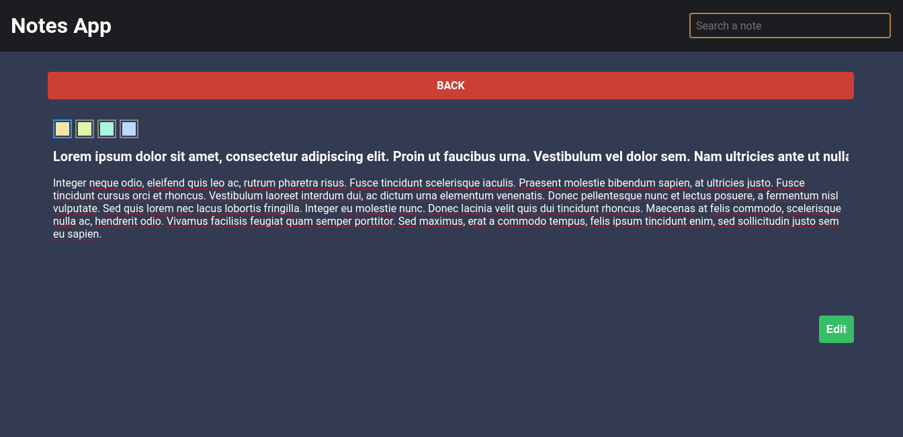
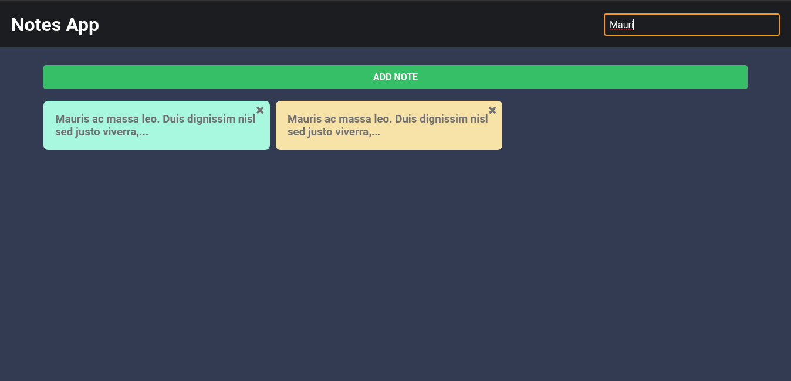

# Notes App

Many times we need to write down something, and from that idea the Notes App is born. This allows you to add, edit, search and delete a note, working with localStorage.

You can see the project working on it by [clicking here](https://notes-app-cesaralvarod.netlify.app)



Adding a note:



Editing a note:



Searching a note:



# Content

- [Clone](#clone)
- [Starting](#starting)
- [Testing](#testing)
- [Deploy](#deploy)
- [Technologies](#technologies)
- [Copyright](#copyright)

# Clone

To install the project you have to clone the repository:

```
git clone https://github.com/cesaralvarod/notesapp-react
```

Now go to the project folder

```
cd notesapp-react/
```

# Starting

## Pre-requeriments

- NodeJS

  You must have NodeJS installed to be able to run npm commands

## Installation

To install the dependencies of **Notes App** you need to run:

```
npm install
```

Runs the app in the development mode. Open _localhost:3000_ to view it in your favorite browser.

# Testing

To test the project run the following command. This launches the test runner in the interactive watch mode:

```
npm test
```

# Deploy

To deploy the project run the following command:

```
npm build
```

# Technologies

- [React](https://reactjs.org/) - The most popular javascript's framework

# Copyright

&copy; **Notes App** - [cesaralvarod](https://github.com/cesaralvarod) 2021
